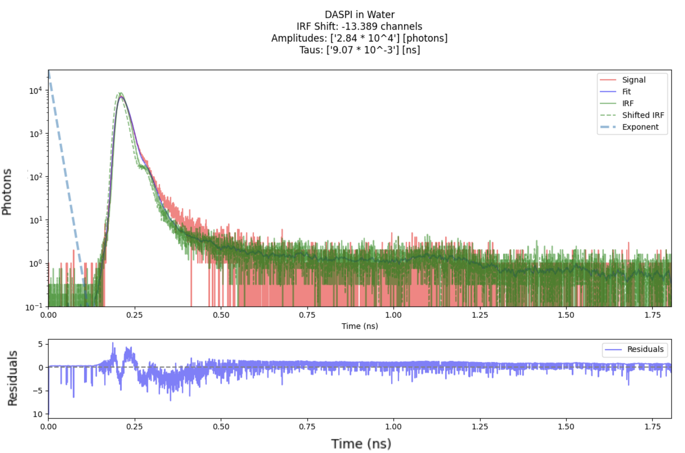

# Fluorescence Lifetime Imaging Microscopy Reconvolution Toolkit

**Author:** Mykyta Kizilov  
**Affiliation:** Advanced Spectroscopy Laboratory, Texas A&M University  


This repository contains Python scripts for performing reconvolution curve fitting using both custom NNLS-based and lmfit-based methods. These scripts are designed to analyze time-resolved fluorescence decay data by fitting exponential decay models convolved with an instrument response function (IRF).

---

## Features

- Parse single FLIM `.asc` files and ordered sets (e.g., time-series cycles).
- Baseline removal and optional Savitzky–Golay smoothing.
- Consistent trimming, time-zero alignment, and IRF normalization.
- Fast FFT-based convolution and sub-channel IRF shifting.
- NNLS amplitude estimation with non-negative constraint and DC offset.
- Global search of decay constants (taus) + IRF shift via Differential Evolution.
- Diagnostics: χ² (reduced), residuals, component curves, IRF overlay.
- Batch histograms of metrics (peak, FWHM, integral) with “bad-bin” interpolation.
- Publication-ready plots (log-scale photons).

---

## Installation

```bash
python -m venv .venv
source .venv/bin/activate  # Windows: .venv\Scripts\activate
pip install -U numpy pandas matplotlib scipy
```

> Optional: pin versions for reproducibility (e.g., `numpy>=1.24`, `scipy>=1.11`, `matplotlib>=3.7`, `pandas>=2.0`).

---

## Data expectations

- **File format:** ASCII `.asc` with tab separator and header line containing  
  `*BLOCK 1  ( Time[ns]  No_of_photons )`.
- **Columns after parsing:** `Time` (ns), `Photons` (counts).
- **Series naming:** If using `parse_FLIM_set`, filenames should end with cycle tag like `...c12.asc` (the code sorts by the trailing number matched with `r'c(\d+)\.asc$'`).

---

## Quick start

```python
import os
from pathlib import Path

# 1) Load a signal/IRF pair
signal = parse_FLIM("data/my_sample_signal.asc")
irf    = parse_FLIM("data/my_sample_irf.asc")

# 2) Prepare (trim zero regions, align time-zero, match lengths, normalize IRF)
sig_prep, irf_prep = prepare_data(signal, irf, window_length=7, polyorder=2)

# 3) Fit a bi-exponential with bounded taus and an IRF shift search
taus, amps, irf_shift, offset, chi2_red = reconvolution_fit(
    FLIM_data=[sig_prep, irf_prep],
    exp_num=2,
    tau_bounds=[(0.02, 0.5), (0.5, 5.0)],   # ns
    irf_shift_bounds=[-50, 50],             # in channels
    smooth=None,
    maxiter=1500,
    workers=1,
    plot_title="Bi-exponential reconvolution",
    filename="fit_bi_exp"
)

print("taus (ns):", taus)
print("amps (photons):", amps)
print("IRF shift (channels):", irf_shift)
print("DC offset (photons):", offset)
print("reduced chi2:", chi2_red)
```

**Batch parsing & overview plots:**
```python
dfs = parse_FLIM_set(directory="data/time_series", file_startswith="sample_")
plot_FLIM_spectrum(dfs, min_scale=1, title="Time-series photon decays")
plot_histogram(dfs, what_to_plot='fwhm', min_scale=1, plot_name='FWHM over minutes')
```

---

## Typical workflow

1. **Parse** the raw `.asc` files → `parse_FLIM` / `parse_FLIM_set`.
2. **(Optional) Smooth** for visualization → `apply_savgol`.
3. **Prepare** signal/IRF (trim zeros, align time zero, equalize length, normalize IRF) → `prepare_data`.
4. **Fit** reconvolution model (global DE for taus + IRF shift; NNLS for non-negative amplitudes + DC) → `reconvolution_fit`.
5. **Inspect** plots & residuals → `plot_reconvolution`.
6. **Aggregate** metrics over many cycles → `plot_histogram`.

---

## API reference (selected)

### Parsing & utilities
- `parse_FLIM(filename) -> pd.DataFrame`  
  Reads a single `.asc` into columns `Time`, `Photons`. Drops non-numeric/infinite entries and sorts by time.

- `parse_FLIM_set(directory, file_startswith) -> list[pd.DataFrame]`  
  Loads and sorts multiple `.asc` files using the cycle number matched by `c(\d+)` before `.asc`.

- `apply_savgol(df, window_length=5, polyorder=3, title=None) -> pd.DataFrame`  
  Savitzky–Golay smooth for visualization; overlays original vs. smoothed on log-y plot.

- `prepare_data(df_signal, df_irf, window_length=None, polyorder=None) -> (signal, irf)`  
  Trims leading/trailing zeros, optional rolling mean smoothing, shifts both to `t=0`, matches lengths, **normalizes IRF area to 1.**

### Maths & modelling
- `convolve(x, h)`  
  Linear convolution via FFT, returns length of `x` (signal-length crop).

- `find_irf_shift(signal, irf) -> int`  
  Coarse shift estimate from argmax indices.

- `shift_irf(irf, irf_shift)`  
  Fractional-channel circular shift with linear interpolation between neighboring samples.

- `nnls_convol_irfexp(x_data, irf, p0, signal_values)`  
  Builds design matrix `[IRF⊗exp(-t/τ₁), …, IRF⊗exp(-t/τ_K), 1]`, solves `NNLS` for amplitudes and DC.

- `residual_function(params, x_data, irf_values, y_data)`  
  Given `params = [irf_shift, τ₁..τ_K]`, computes reduced χ² using Poisson-like weighting `1/√(fit+1)`.

- `reconvolution_fit(FLIM_data, exp_num=1, tau_bounds=None, irf_shift_bounds=[-500,500], smooth=None, maxiter=1000, disp=False, workers=1, plot_title=None, filename=None)`  
  **Global** optimization (Differential Evolution) over IRF shift and τs, **then** NNLS amplitudes + DC; returns  
  `(taus_sorted, amplitudes_sorted, irf_shift_opt, dc_offset, reduced_chi2)` and optionally plots.

### Plotting & metrics
- `plot_FLIM_spectrum(dataframes, min_scale=1, title="Spectra Plot")`  
  Overlay one or many decays (log-y), with a colorbar for series.

- `plot_histogram(dataframes, what_to_plot='max_photons'|'fwhm'|'integral', min_scale=1, bad_bins=None, window_length=11, polyorder=2, plot_name='Plot')`  
  Batch compute metric per file and bar-plot across cycles; interpolate specified `bad_bins`.

- `plot_reconvolution(times, signal, fit, irf, irf_shift, taus, amplitudes, plot_title, filename=None)`  
  Two-panel figure: log-scale fits with IRF overlays + residuals; reports χ²_ν and parameters. Saves to `plots/filename.png` if provided.

---

## Modelling notes

- **Model:** $y(t) \approx \big(\sum_k a_k e^{-t/\tau_k}\big) \ast \text{IRF}(t - \Delta) + c$, with $a_k \ge 0$, $c \ge 0$.  
- **Why NNLS?** Enforces physical non-negativity of components and DC background; avoids sign-flip artifacts.  
- **Why Differential Evolution?** The objective is non-convex in $\tau_k$ and IRF shift; DE provides robust global search before amplitude estimation.  
- **Weights:** Residuals are scaled by $\sqrt{\text{fit}+1}$ to approximate Poisson statistics in photon counting.

---

## Practical guidance

- **Taus & bounds:** Provide problem-specific bounds in **ns** (e.g., `[ (0.05,0.5), (0.5,5.0) ]`). Too-wide bounds slow convergence.
- **IRF shift bounds:** Expressed in **channels/samples**, not ns. Convert using your instrument’s bin width.
- **Smoothing:** Use only for visualization (`apply_savgol`) or gentle rolling means during `prepare_data`. Do not over-smooth prior to fitting.
- **Baseline/DC:** The NNLS model includes a constant offset; no external baseline subtraction required for fitting.
- **Data trimming:** `prepare_data` auto-trims zero regions (leading/trailing). Ensure the peak is retained.
- **Parallelism:** `workers` in `reconvolution_fit` passes through to SciPy DE; choose `workers=-1` for all cores (SciPy ≥1.9).
- **Reproducibility:** Set `np.random.seed(...)` before calling DE if you need repeatable runs (SciPy accepts a `seed` via `differential_evolution(..., seed=...)`—add if needed).

---

## Example: tri-exponential fit

```python
taus, amps, shift, dc, chi2 = reconvolution_fit(
    [signal, irf],
    exp_num=3,
    tau_bounds=[(0.05,0.5), (0.5,3.0), (3.0,12.0)],
    irf_shift_bounds=[-40, 40],
    maxiter=2000,
    workers=-1,
    plot_title="Tri-exponential reconvolution"
)
```

---

## Troubleshooting

- **“ValueError: Unknown plot option”** → Use one of `max_photons | fwhm | integral`.
- **Flat lines / NaNs after parsing** → Check that the file contains the required `*BLOCK 1...` header and tab separators.
- **Exploding χ² or noisy residuals** → Narrow `tau_bounds`; verify IRF is from the same setup and not saturated; consider `smooth=None` during fitting.
- **Negative or zero times** → Allowed; plots and fitting use time differences post-alignment.
- **IRF much shorter than signal** → `prepare_data` matches lengths by truncation; supply equally sampled inputs where possible.

---

## File organization

```
project/
├─ data/
│  ├─ my_sample_signal.asc
│  └─ my_sample_irf.asc
├─ plots/                 # created on save
└─ analysis.ipynb         # your scripts/notebooks
```

---

## Extending

- Add **per-component fractional contributions:** `f_k = a_k τ_k / Σ_j a_j τ_j`.
- Add **multi-ROI or pixelwise fitting:** vectorize `nnls_convol_irfexp` and cache IRF⊗exp design matrices.
- Expose `seed` arg to `reconvolution_fit` for reproducibility.
- Support **time-bin width (Δt)** to convert channel shift ↔ ns.

---

## License

See [`LICENSE`](./LICENSE).

---

## Function index (cheat sheet)

- I/O: `parse_FLIM`, `parse_FLIM_set`, `extract_cycle_number`
- Prep: `apply_savgol`, `prepare_data`
- Maths: `convolve`, `find_irf_shift`, `shift_irf`, `exp_decay`, `sci_notation`
- Core fit: `nnls_convol_irfexp`, `model_func`, `residual_function`, `reconvolution_fit`
- Metrics/plots: `calculate_fwhm`, `calculate_integral`, `plot_FLIM_spectrum`, `plot_histogram`, `plot_reconvolution`

---

**Ready-to-use outcome:** Load your `.asc` signal and IRF, run `prepare_data`, call `reconvolution_fit` with realistic `tau_bounds` and `irf_shift_bounds`, and inspect the plot + χ²_ν. That’s the full reconvolution loop.
